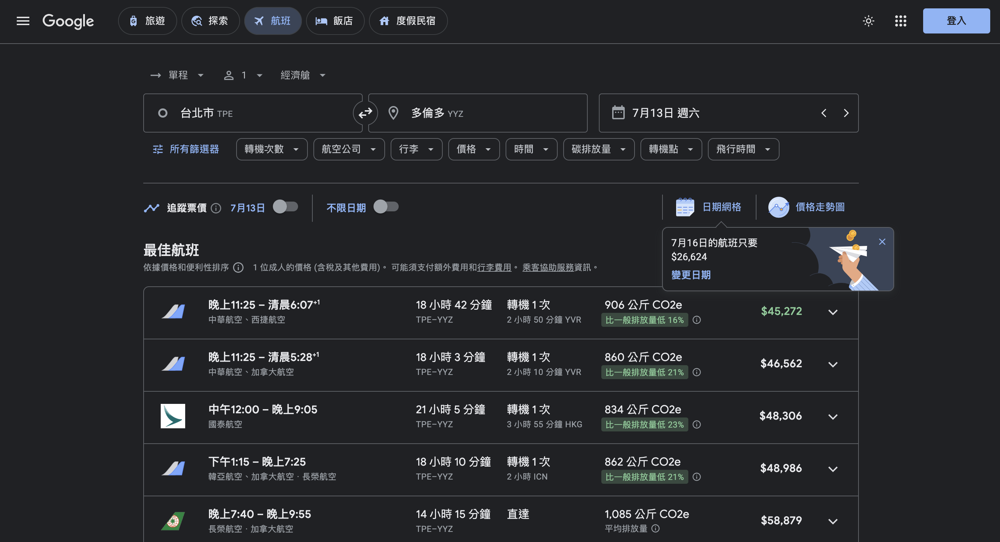
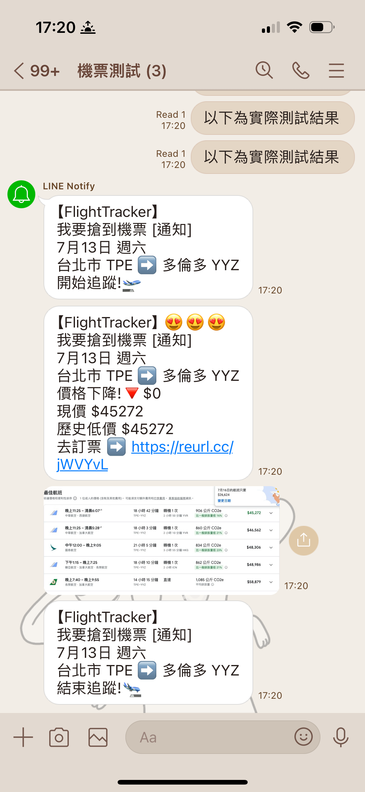

# FlightTracker

FlightTracker is a Python script designed to track flight prices for specified routes (round trip or one way) and send notifications about price changes using the LINE Notify API. The script utilizes Selenium WebDriver to scrape Google Flight search pages and can be configured to check prices at regular intervals.

## Features

- Track flight prices for predefined routes (via Google Flight link).
- Send notifications via LINE Notify when there is a significant price change.
- Configurable time interval for price checks.
- Headless execution for server environments.




## Prerequisites

This script has been tested on `MacOS` in the following environment:

- `python: 3.8.19`
- `selenium: 4.21.0`
- `requests: 2.32.2`
- `python-dotenv: 1.0.1`

## How to Run

#### Installation

1. Clone the repository:
    ```sh
    git clone https://github.com/BrianEE07/FlightTracker.git
    cd FlightTracker
    ```

2. Create conda environment with required Python packages:
    ```sh
    conda create -n flight_tracker python=3.8.19
    conda activate flight_tracker
    pip install -r requirements.txt
    ```

#### Configuration

Create a `.env` file in the project directory and add your LINE Notify token:
```sh
echo "LINE_NOTIFY_TOKEN=<YOUR_LINE_NOTIFY_TOKEN>" > .env
```
For more information on how to get a LINE Notify token, refer to the [Python自動通知 via Line Notify](https://blog.raymond-investment.com/python-notify-via-line/)

#### Usage

To run the script, use the following command:

```sh
python flight_tracker.py --flight <FLIGHT_URL> [--threshold <PRICE_THRESHOLD>] [--time <TIME_INTERVAL>] [--debug]
```

##### Arguments

- `--flight`: Flight URL to track. (Required)
- `--threshold`: Price threshold (in NTD) to check for price changes. (Default is 500)
- `--time`: Time interval (in seconds) between price checks. (Default is 20)
- `--debug`: Enable debug mode, which prints messages instead of sending push notifications.

##### Example

Track flight prices with default settings:

```sh
python flight_tracker.py --flight "https://reurl.cc/jWVYvL"
```

Track flight prices with custom threshold and time interval:

```sh
python flight_tracker.py --flight "https://reurl.cc/jWVYvL" --threshold 600 --time 30
```

Enable debug mode:

```sh
python flight_tracker.py --flight "https://reurl.cc/jWVYvL" --debug
```

## How It Works
- The script initializes the WebDriver and navigates to the specified flight search page.
- It periodically refreshes the page to check for price changes.
- If a significant price change is detected, a notification is sent via LINE Notify (or printed if in debug mode).
- The script continues running until manually terminated.

## Acknowledgements
- LINE Notify API
- Selenium WebDriver
- This README.md is mostly generated using ChatGPT
